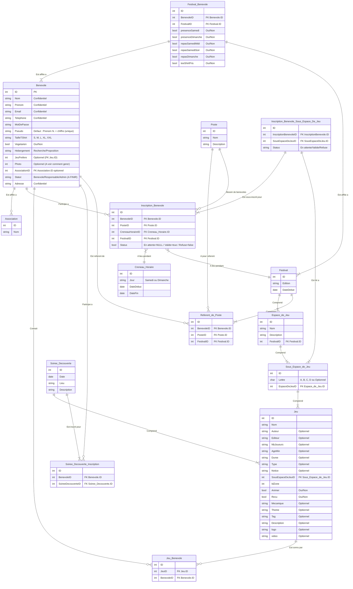

# Projet AWI - Back

## Technologies

- Express.js
- PostgreSQL
- Prisma
- TypeScript
- Mermaid

## MCD 

## Auteurs

- [Léon BOUDIER]([https://https://github.com/TAIP25)
- [Robin AVELINE]([https://github.com/Robinkss)