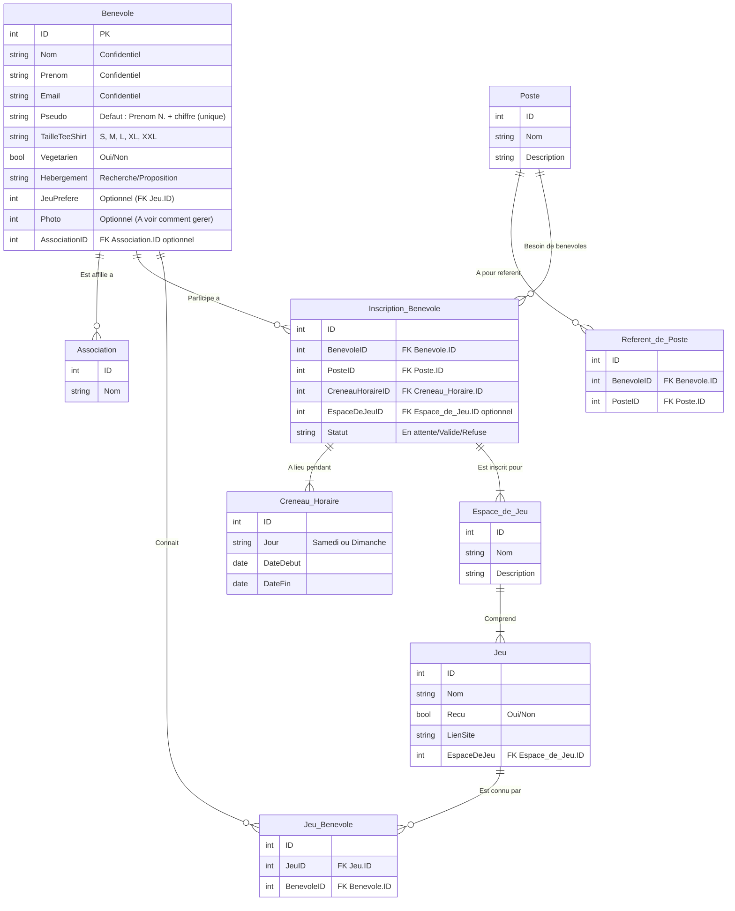

# MCD

L'attribut **EspacedeJeuID** de la table **Inscription_Benevole** est optionnel car il n'est pas obligatoire de s'inscrire pour un espace de jeu dans le cas où l'on s'inscrit pas dans animation jeux.